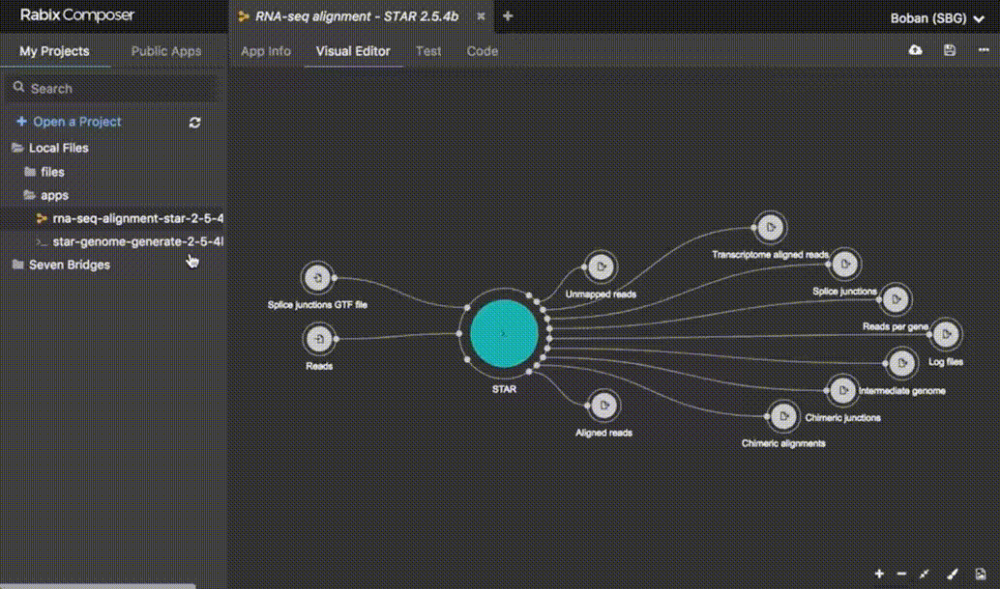
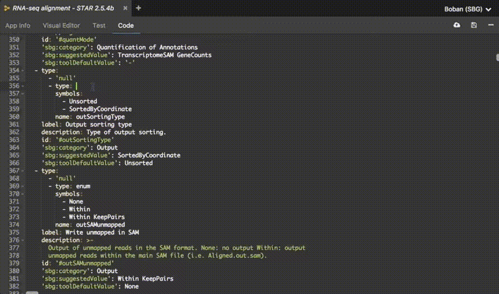

# Rabix Composer
[](https://github.com/rabix/composer/actions?query=workflow%3ATests)
[](https://github.com/rabix/composer/actions?query=workflow%3ARelease)


Rabix Composer is an open source visual editor for [Common Workflow
Language](https://github.com/common-workflow-language/common-workflow-language)
documents.

It has a graphical mode allowing drag and drop creation of workflows
and a wizard for creation of individual tools.



It also has a text mode for entering CWL code directly. The graphical and text
modes work seamlessly together.



## Dependencies

- [Node.js](https://nodejs.org/en/)
- [yarn](https://yarnpkg.com/en/)

## Installation

**The current release requires Node 8 to build properly. In an upcoming release we
will update the code and dependencies so that they will work on the latest
node.** 

The [npm package `n`][npm-n] can be helpful in managing node versions, especially on
macOS Catalina, where Python2 has been removed.

[npm-n]: https://www.npmjs.com/package/n

**The following commands should all be done using node8**

```bash
git clone https://github.com/rabix/composer
cd composer
yarn install
```

**If you are using Linux:**

Install node.js from https://nodejs.org/en/download/package-manager/#debian-and-ubuntu-based-linux-distributions

Install yarn using Linux instructions provided on https://yarnpkg.com/lang/en/docs/install/

## Starting the dev environment
```bash
yarn run serve // starts the dev server
yarn run compile:electron // compiles electron backend
yarn run start:electron // opens the app shell
```

## Packaging the build as a desktop app for the host system and architecture
```bash
yarn run build
```


## Running the tests
```bash
yarn test
```

## Documentation

Now you can read the [Rabix Composer documentation](http://docs.rabix.io/) to learn more about Rabix Composer.
